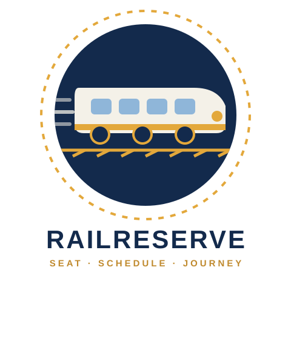

# Railway Reservation System - SQL Project



## Overview
This project involves designing and building a Railway Reservation System database from scratch using **SQL**. It covers the full process of modeling real-world entities (stations, trains, routes, schedules, passengers, tickets, and payments) into a normalized relational schema, populating it with sample data, and writing SQL queries of varying complexity (basic, joins, aggregations, and subqueries) — along with views, triggers, and stored procedures to automate booking logic. The primary goals of the project are to practice core and advanced SQL skills and build a realistic, end-to-end database system.

## Tables
-- ------------------------------------------------------------
-- 1. STATION
-- ------------------------------------------------------------
 ```sql
CREATE TABLE Station (
    station_id     SERIAL PRIMARY KEY,
    station_name   VARCHAR(100) NOT NULL,
    station_code   VARCHAR(10)  NOT NULL UNIQUE,
    city           VARCHAR(100) NOT NULL,
    state          VARCHAR(100)
);
  ```
-- ------------------------------------------------------------
-- 2. TRAIN
-- ------------------------------------------------------------
 ```sql
CREATE TABLE Train (
    train_id       SERIAL PRIMARY KEY,
    train_number   VARCHAR(10) NOT NULL UNIQUE,
    train_name     VARCHAR(100) NOT NULL,
    total_seats    INT NOT NULL CHECK (total_seats > 0),
    train_type     VARCHAR(30) DEFAULT 'Express'
);
 ``` 
-- ------------------------------------------------------------
-- 3. ROUTE
-- ------------------------------------------------------------
 ```sql
CREATE TABLE Route (
    route_id           SERIAL PRIMARY KEY,
    train_id           INT NOT NULL REFERENCES Train(train_id) ON DELETE CASCADE,
    source_station_id  INT NOT NULL REFERENCES Station(station_id),
    destination_station_id INT NOT NULL REFERENCES Station(station_id),
    distance_km        DECIMAL(7,2),
    CHECK (source_station_id <> destination_station_id)
);
 ``` 
-- ------------------------------------------------------------
-- 4. ROUTE_STOPS
-- ------------------------------------------------------------
 ```sql
CREATE TABLE Route_Stops (
    route_id       INT NOT NULL REFERENCES Route(route_id) ON DELETE CASCADE,
    station_id     INT NOT NULL REFERENCES Station(station_id),
    sequence_no    INT NOT NULL,
    arrival_time   TIME,
    departure_time TIME,
    PRIMARY KEY (route_id, station_id),
    UNIQUE (route_id, sequence_no)
);
  ```
-- ------------------------------------------------------------
-- 5. SCHEDULE
-- ------------------------------------------------------------
 ```sql
CREATE TABLE Schedule (
    schedule_id    SERIAL PRIMARY KEY,
    train_id       INT NOT NULL REFERENCES Train(train_id) ON DELETE CASCADE,
    run_date       DATE NOT NULL,
    departure_time TIME NOT NULL,
    arrival_time   TIME NOT NULL,
    status         VARCHAR(20) DEFAULT 'ON_TIME' CHECK (status IN ('ON_TIME','DELAYED','CANCELLED')),
    UNIQUE (train_id, run_date)
);
  ```
-- ------------------------------------------------------------
-- 6. SEAT_CLASS
-- ------------------------------------------------------------
 ```sql
CREATE TABLE Seat_Class (
    class_id       SERIAL PRIMARY KEY,
    class_name     VARCHAR(20) NOT NULL UNIQUE,
    fare_per_km    DECIMAL(6,2) NOT NULL
);
  ```
-- ------------------------------------------------------------
-- 7. SCHEDULE_SEAT_AVAILABILITY
-- ------------------------------------------------------------
 ```sql
CREATE TABLE Schedule_Seat_Availability (
    schedule_id    INT NOT NULL REFERENCES Schedule(schedule_id) ON DELETE CASCADE,
    class_id       INT NOT NULL REFERENCES Seat_Class(class_id),
    total_seats    INT NOT NULL,
    available_seats INT NOT NULL,
    PRIMARY KEY (schedule_id, class_id),
    CHECK (available_seats >= 0 AND available_seats <= total_seats)
);
  ```
-- ------------------------------------------------------------
-- 8. PASSENGER
-- ------------------------------------------------------------
 ```sql
CREATE TABLE Passenger (
    passenger_id   SERIAL PRIMARY KEY,
    full_name      VARCHAR(100) NOT NULL,
    age            INT CHECK (age > 0 AND age < 120),
    gender         VARCHAR(10) CHECK (gender IN ('M','F','O')),
    email          VARCHAR(100) UNIQUE,
    phone          VARCHAR(15) NOT NULL
);
  ```
-- ------------------------------------------------------------
-- 9. TICKET / BOOKING
-- ------------------------------------------------------------
 ```sql
CREATE TABLE Ticket (
    ticket_id      SERIAL PRIMARY KEY,
    passenger_id   INT NOT NULL REFERENCES Passenger(passenger_id),
    schedule_id    INT NOT NULL REFERENCES Schedule(schedule_id),
    class_id       INT NOT NULL REFERENCES Seat_Class(class_id),
    seat_no        VARCHAR(10),
    booking_date   TIMESTAMP DEFAULT CURRENT_TIMESTAMP,
    status         VARCHAR(20) DEFAULT 'CONFIRMED' CHECK (status IN ('CONFIRMED','WAITLIST','CANCELLED')),
    fare           DECIMAL(8,2) NOT NULL
);
  ```
-- ------------------------------------------------------------
-- 10. PAYMENT
-- ------------------------------------------------------------
 ```sql
CREATE TABLE Payment (
    payment_id     SERIAL PRIMARY KEY,
    ticket_id      INT NOT NULL UNIQUE REFERENCES Ticket(ticket_id) ON DELETE CASCADE,
    amount         DECIMAL(8,2) NOT NULL,
    payment_mode   VARCHAR(20) CHECK (payment_mode IN ('UPI','CARD','NETBANKING','CASH')),
    payment_status VARCHAR(20) DEFAULT 'SUCCESS' CHECK (payment_status IN ('SUCCESS','FAILED','REFUNDED')),
    payment_date   TIMESTAMP DEFAULT CURRENT_TIMESTAMP
);
  ```
-- ------------------------------------------------------------
-- Indexes
-- ------------------------------------------------------------
```sql
CREATE INDEX idx_train_number ON Train(train_number);
CREATE INDEX idx_station_code ON Station(station_code);
CREATE INDEX idx_ticket_passenger ON Ticket(passenger_id);
CREATE INDEX idx_schedule_date ON Schedule(run_date);
 ```

## Project Steps
### 1. Data Modeling
Before writing any SQL, the entities and relationships were mapped out. The system is built around these core entities:
- `Station`: Physical stations with a name, code, city, and state.
- `Train`: Individual trains with a number, name, type, and total seat count.
- `Route` & `Route_Stops`: A train's source-to-destination route, plus every intermediate stop in sequence.
- `Schedule`: A specific run of a train on a specific date, with its own status (on-time, delayed, cancelled).
- `Seat_Class` & `Schedule_Seat_Availability`: Fare classes (SL, 3A, 2A, 1A, GEN) and live seat counts per schedule.
- `Passenger`, `Ticket`, `Payment`: Who booked, what they booked, and how they paid.

### 2. Building the Schema
The schema was normalized to 3NF — seat availability is tracked per (schedule, class) rather than duplicated on every ticket, and station/route details aren't repeated across tables. Primary keys, foreign keys, and `CHECK` constraints enforce data integrity directly at the database level.

### 3. Populating Sample Data
Sample rows were inserted for every table — 10 stations, 8 trains, 8 routes with stops, 10 passengers, 11 tickets, and matching payments — enough to make joins and aggregate queries meaningful.

### 4. Querying the Data
After the data is inserted, various SQL queries can be written to explore and analyze the data. Queries are categorized into **basic**, **join**, **aggregation**, and **subquery** levels to progressively demonstrate SQL proficiency.

#### Basic Queries
- Simple data retrieval, filtering, and single-table lookups (e.g. a passenger's booking history).

#### Join Queries
- Multi-table joins connecting tickets, passengers, trains, routes, and payments into full readable records.

#### Aggregation Queries
- `GROUP BY`-based queries such as revenue per train, most-booked routes, and occupancy rate per schedule.

#### Subquery Queries
- Nested and correlated subqueries — e.g. passengers who've never cancelled a ticket, schedules above a given occupancy threshold, and highest-revenue train.

### 5. Automation Layer
- **Views**: A consolidated `vw_ticket_details` view joins ticket, passenger, train, route, and payment data into one queryable report.
- **Triggers**: Automatically adjust seat availability when a ticket is booked or cancelled.
- **Stored Procedures**: `BookTicket` and `CancelTicket` wrap booking and cancellation logic inside transactions, so a seat deduction and ticket insert either both succeed or both roll back.

### 6. Query Optimization
Indexes were added on frequently searched columns (`train_number`, `station_code`, `passenger_id`, `run_date`) to speed up common lookups.
---

## A. BASIC QUERIES

A1. List all trains
```sql
SELECT train_number, train_name, train_type, total_seats FROM Train;
```
A2. Find all schedules running on a given date
```sql
SELECT s.schedule_id, t.train_name, s.departure_time, s.arrival_time, s.status
FROM Schedule s
JOIN Train t ON s.train_id = t.train_id
WHERE s.run_date = '2026-08-05';
```
A3. Available seats for a specific schedule, by class
```sql
SELECT sc.class_name, sa.available_seats
FROM Schedule_Seat_Availability sa
JOIN Seat_Class sc ON sa.class_id = sc.class_id
WHERE sa.schedule_id = 1;
```
A4. A passenger's full booking history
```sql
SELECT tk.ticket_id, tr.train_name, s.run_date, sc.class_name, tk.status, tk.fare
FROM Ticket tk
JOIN Schedule s ON tk.schedule_id = s.schedule_id
JOIN Train tr ON s.train_id = tr.train_id
JOIN Seat_Class sc ON tk.class_id = sc.class_id
WHERE tk.passenger_id = 1;
```
## B. JOIN QUERIES

B1. Full ticket details: passenger + train + route + payment
```sql
SELECT
    tk.ticket_id,
    p.full_name       AS passenger,
    tr.train_name,
    src.station_name   AS source,
    dst.station_name   AS destination,
    s.run_date,
    sc.class_name,
    tk.status,
    pay.payment_status
FROM Ticket tk
JOIN Passenger p        ON tk.passenger_id = p.passenger_id
JOIN Schedule s          ON tk.schedule_id = s.schedule_id
JOIN Train tr             ON s.train_id = tr.train_id
JOIN Route r              ON r.train_id = tr.train_id
JOIN Station src          ON r.source_station_id = src.station_id
JOIN Station dst          ON r.destination_station_id = dst.station_id
JOIN Seat_Class sc        ON tk.class_id = sc.class_id
LEFT JOIN Payment pay     ON pay.ticket_id = tk.ticket_id
ORDER BY tk.ticket_id;
```
B2. All intermediate stations a train passes through, in order
```sql
SELECT tr.train_name, st.station_name, rs.sequence_no, rs.arrival_time, rs.departure_time
FROM Route_Stops rs
JOIN Route r  ON rs.route_id = r.route_id
JOIN Train tr ON r.train_id = tr.train_id
JOIN Station st ON rs.station_id = st.station_id
WHERE tr.train_number = '12951'
ORDER BY rs.sequence_no;
```
B3. Trains that run between two specific cities
```sql
SELECT DISTINCT tr.train_name, tr.train_number, src.city AS from_city, dst.city AS to_city
FROM Route r
JOIN Train tr ON r.train_id = tr.train_id
JOIN Station src ON r.source_station_id = src.station_id
JOIN Station dst ON r.destination_station_id = dst.station_id
WHERE src.city = 'Delhi' AND dst.city = 'Mumbai';
```
## C. AGGREGATION QUERIES

C1. Total revenue per train
```sql
SELECT tr.train_name, SUM(pay.amount) AS total_revenue
FROM Payment pay
JOIN Ticket tk ON pay.ticket_id = tk.ticket_id
JOIN Schedule s ON tk.schedule_id = s.schedule_id
JOIN Train tr ON s.train_id = tr.train_id
WHERE pay.payment_status = 'SUCCESS'
GROUP BY tr.train_name
ORDER BY total_revenue DESC;
```
C2. Most booked routes (by confirmed ticket count)
```sql
SELECT tr.train_name, COUNT(*) AS confirmed_bookings
FROM Ticket tk
JOIN Schedule s ON tk.schedule_id = s.schedule_id
JOIN Train tr ON s.train_id = tr.train_id
WHERE tk.status = 'CONFIRMED'
GROUP BY tr.train_name
ORDER BY confirmed_bookings DESC;
```
C3. Occupancy rate (%) per schedule
```sql
SELECT
    s.schedule_id,
    tr.train_name,
    s.run_date,
    SUM(sa.total_seats) AS total_seats,
    SUM(sa.total_seats - sa.available_seats) AS seats_booked,
    ROUND(SUM(sa.total_seats - sa.available_seats) * 100.0 / SUM(sa.total_seats), 2) AS occupancy_pct
FROM Schedule_Seat_Availability sa
JOIN Schedule s ON sa.schedule_id = s.schedule_id
JOIN Train tr ON s.train_id = tr.train_id
GROUP BY s.schedule_id, tr.train_name, s.run_date
ORDER BY occupancy_pct DESC;
```
C4. Revenue collected by payment mode
```sql
SELECT payment_mode, COUNT(*) AS num_transactions, SUM(amount) AS total_amount
FROM Payment
WHERE payment_status = 'SUCCESS'
GROUP BY payment_mode;
```
## D. SUBQUERIES / ADVANCED

D1. Passengers who have NEVER had a cancelled ticket
```sql
SELECT p.full_name
FROM Passenger p
WHERE p.passenger_id NOT IN (
    SELECT passenger_id FROM Ticket WHERE status = 'CANCELLED'
);
```
D2. Schedules with occupancy above 90%
```sql
SELECT s.schedule_id, tr.train_name, s.run_date
FROM Schedule s
JOIN Train tr ON s.train_id = tr.train_id
WHERE s.schedule_id IN (
    SELECT schedule_id
    FROM Schedule_Seat_Availability
    GROUP BY schedule_id
    HAVING SUM(total_seats - available_seats) * 100.0 / SUM(total_seats) > 90
);
```
D3. Waitlisted passengers, ranked by booking date (oldest first = highest priority)
```sql
SELECT tk.ticket_id, p.full_name, s.run_date, tk.booking_date
FROM Ticket tk
JOIN Passenger p ON tk.passenger_id = p.passenger_id
JOIN Schedule s ON tk.schedule_id = s.schedule_id
WHERE tk.status = 'WAITLIST'
ORDER BY tk.booking_date ASC;
```
D4. Train with the highest total revenue (correlated subquery style)
```sql
SELECT tr.train_name,
       (SELECT SUM(pay.amount)
        FROM Payment pay
        JOIN Ticket tk ON pay.ticket_id = tk.ticket_id
        JOIN Schedule s ON tk.schedule_id = s.schedule_id
        WHERE s.train_id = tr.train_id AND pay.payment_status = 'SUCCESS') AS revenue
FROM Train tr
ORDER BY revenue DESC
LIMIT 1;
```
D5. Passengers who booked more than one ticket
```sql
SELECT p.full_name, COUNT(*) AS ticket_count
FROM Ticket tk
JOIN Passenger p ON tk.passenger_id = p.passenger_id
GROUP BY p.full_name
HAVING COUNT(*) > 1;
```
## RAILWAY RESERVATION SYSTEM - VIEWS

View 1: Consolidated ticket details - passenger + train + route + payment
```sql
CREATE OR REPLACE VIEW vw_ticket_details AS
SELECT
    tk.ticket_id,
    p.full_name       AS passenger_name,
    p.phone,
    tr.train_name,
    tr.train_number,
    src.station_name  AS source_station,
    dst.station_name  AS destination_station,
    s.run_date,
    s.departure_time,
    sc.class_name,
    tk.seat_no,
    tk.status          AS ticket_status,
    tk.fare,
    pay.payment_status
FROM Ticket tk
JOIN Passenger p    ON tk.passenger_id = p.passenger_id
JOIN Schedule s     ON tk.schedule_id = s.schedule_id
JOIN Train tr       ON s.train_id = tr.train_id
JOIN Route r        ON r.train_id = tr.train_id
JOIN Station src    ON r.source_station_id = src.station_id
JOIN Station dst    ON r.destination_station_id = dst.station_id
JOIN Seat_Class sc  ON tk.class_id = sc.class_id
LEFT JOIN Payment pay ON pay.ticket_id = tk.ticket_id;
```
---
## Technology Stack
- **Database**: PostgreSQL
- **SQL Queries**: DDL, DML, Aggregations, Joins, Subqueries, Views
- **Tools**: pgAdmin 4 (or any SQL editor), PostgreSQL (via direct installation, Docker, or an online sandbox like DB Fiddle)
---
## How to Run the Project
1. Install PostgreSQL and pgAdmin (if not already installed).
2. Create a database named `railway_reservation`.
3. Run `01_schema.sql` to set up all tables, keys, and constraints.
4. Run `02_sample_data.sql` to insert sample stations, trains, passengers, and tickets.
5. Run `03_queries.sql` to execute the practice queries — basic, joins, aggregations, and subqueries.
6. Run `04_views.sql` to create the reporting views.
---
